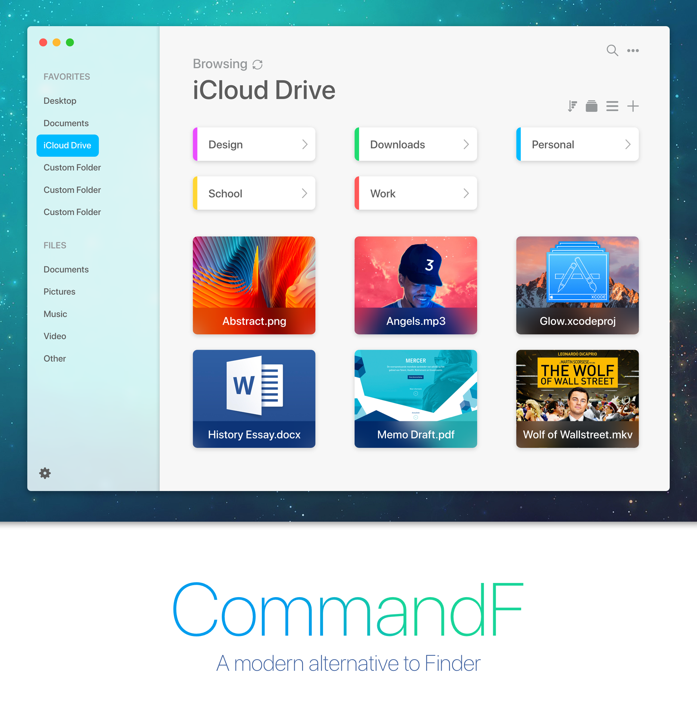

<b>CommandF</b> is a new, modern take on the classic Finder app. Currently in heavy development.

## Goals
CommandF was built from the ground up for durability and speed. The end goal is to create a beautiful, open-source product written in Swift.

### Fundamental Goals
- Basic Finder Foundation
- Take Full Advantage of [APFS](https://developer.apple.com/library/content/documentation/FileManagement/Conceptual/APFS_Guide/Introduction/Introduction.html)
- Speedy Navigation & Gesture Control
- A Modern Take on the Classic Finder App
- Additional Functionality (FTP, SSH, Cloud Drives)

## Progress
- [ ] Foundation
    - [ ] Menu View
    - [ ] Detail View
    - [ ] Files & Folders
    - [ ] Control Functions
    - [ ] Search Functionality
    - [ ] Top Menu Bar
    - [ ] Preferences
    - [ ] Tabs & Windows
    - [ ] Encryption
    - [ ] Animation
    - [ ] Gesture Navigation
    - [ ] Additional Features
    - [ ] Miscellaneous
- [ ] Menu
	- [x] UI Setup
    - [ ] Favorites
    - [x] Custom TableView
    - [ ] Custom Favorites
    - [ ] Files (by Type)
    - [x] Blur Visual FX
    - [x] Menu Source Module
- [ ] Detail
	- [x] UI Setup
	- [ ] Custom TableView Cells
    - [ ] Files (Icons, Blur FX)
    - [ ] Folders (Tags, Colors)
    - [ ] List / Visual View Options
    - [ ] Custom Icon Generation
- [ ] Control Functions
	- [ ] Create
	- [ ] Rename
	- [ ] Move
	- [ ] Copy
	- [ ] Duplicate
	- [ ] Delete
	- [ ] Compression
	- [ ] Decompression
	- [ ] Permissions
- [ ] Search
	- [ ] Efficient Search
	- [ ] Recursive Search
	- [ ] Custom TableView
- [ ] Top Menu Bar
	- [ ] TBD
- [ ] Preferences
	- [ ] See All Files
	- [ ] Favorites Manager
	- [ ] Tags Manager
	- [ ] Default Visual Display
	- [ ] Default Search Parameters
- [ ] Tabs & Windows
	- [ ] Tab Management
	- [ ] New Window Management
- [ ] Encryption
	- [ ] Research
	- [ ] Implement
- [ ] Animation
	- [ ] TBD
- [ ] Gesture Navigation
	- [ ] Swipe Left & Right for Back/Forward
	- [ ] Gesture for Up/Down Directories
	- [ ] TBD
- [ ] Additional Features
	- [ ] SFTP as Native Directories
	- [ ] SSH Functionality
	- [ ] Cloud Drives as Local Directories
- [ ] Miscellaneous
	- [ ] Progress Bar for Loading Tasks
	- [ ] Quick Preview (WKWebView Implementation)

## Known Errors
None as of yet.

## References
None as of yet.

## Requirements
Requires macOS 13.0 or later.
<i>Please note that the app is being built with Swift 4.</i>

## MIT License

Copyright © 2018 Justin Bush & Francesco Virga. All rights reserved.

```
Permission is hereby granted, free of charge, to any person obtaining a copy
of this software and associated documentation files (the "Software"), to deal
in the Software without restriction, including without limitation the rights
to use, copy, modify, merge, publish, distribute, sublicense, and/or sell
copies of the Software, and to permit persons to whom the Software is
furnished to do so, subject to the following conditions:

The above copyright notice and this permission notice shall be included in
all copies or substantial portions of the Software.

THE SOFTWARE IS PROVIDED "AS IS", WITHOUT WARRANTY OF ANY KIND, EXPRESS OR
IMPLIED, INCLUDING BUT NOT LIMITED TO THE WARRANTIES OF MERCHANTABILITY,
FITNESS FOR A PARTICULAR PURPOSE AND NONINFRINGEMENT. IN NO EVENT SHALL THE
AUTHORS OR COPYRIGHT HOLDERS BE LIABLE FOR ANY CLAIM, DAMAGES OR OTHER
LIABILITY, WHETHER IN AN ACTION OF CONTRACT, TORT OR OTHERWISE, ARISING FROM,
OUT OF OR IN CONNECTION WITH THE SOFTWARE OR THE USE OR OTHER DEALINGS IN
THE SOFTWARE.
```
